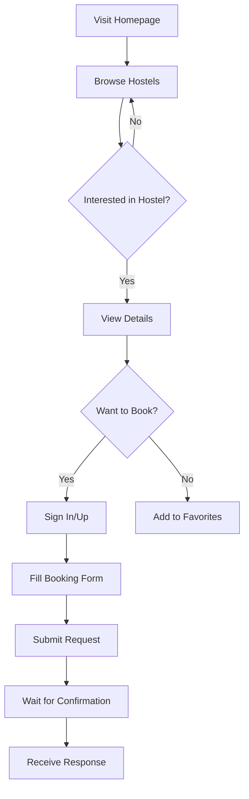
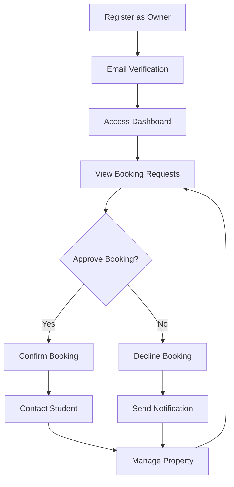

# UniLodge - Student Hostel Booking Platform

## Table of Contents
1. [Project Overview](#project-overview)
2. [Technology Stack](#technology-stack)
3. [Architecture](#architecture)
4. [Database Schema](#database-schema)
5. [Authentication System](#authentication-system)
6. [Key Features](#key-features)
7. [User Flows](#user-flows)
8. [Installation & Setup](#installation--setup)
9. [API Documentation](#api-documentation)
10. [Component Structure](#component-structure)
11. [Design System](#design-system)
12. [Security](#security)
13. [Deployment](#deployment)
14. [Troubleshooting](#troubleshooting)

## Project Overview

UniLodge is a comprehensive student hostel booking platform specifically designed for AAMUSTED (Akenten Appiah-Menka University of Skills Training and Entrepreneurial Development) students. The platform connects students with verified hostel owners, providing a seamless booking experience with real-time availability tracking.

### Key Objectives
- Simplify hostel discovery and booking for AAMUSTED students
- Provide hostel owners with efficient booking management tools
- Ensure secure transactions and verified listings
- Create a trusted community marketplace for student accommodation

### Target Users
- **Students**: AAMUSTED students looking for accommodation
- **Hostel Owners**: Property owners wanting to list their student hostels
- **Administrators**: Platform administrators managing listings and users

## Technology Stack

### Frontend
- **React 18**: Modern UI library with hooks
- **TypeScript**: Type-safe JavaScript development
- **Vite**: Fast build tool and development server
- **Tailwind CSS**: Utility-first CSS framework
- **shadcn/ui**: High-quality React components
- **React Router DOM**: Client-side routing
- **React Hook Form**: Form handling with validation
- **Zod**: Schema validation
- **Lucide React**: Icon library

### Backend & Database
- **Supabase**: PostgreSQL database with real-time capabilities
- **Row Level Security (RLS)**: Database-level security
- **Supabase Auth**: Authentication and user management
- **Supabase Edge Functions**: Serverless functions

### Development Tools
- **ESLint**: Code linting
- **PostCSS**: CSS processing
- **Git**: Version control

## Architecture

### Project Structure
```
src/
├── components/
│   └── ui/                     # Reusable UI components
│       ├── alert.tsx           # Alert component
│       ├── avatar.tsx          # User avatar component
│       ├── badge.tsx           # Status badges
│       ├── booking-form.tsx    # Booking form modal
│       ├── button.tsx          # Button component
│       ├── card.tsx            # Card container
│       ├── dialog.tsx          # Modal dialogs
│       ├── filter-section.tsx  # Search filters
│       ├── hostel-card.tsx     # Hostel listing card
│       ├── hostel-detail-dialog.tsx # Hostel details modal
│       ├── input.tsx           # Form inputs
│       ├── navigation-bar.tsx  # Main navigation
│       └── ...                 # Other UI components
├── hooks/
│   ├── use-auth.tsx            # Authentication hook
│   ├── use-toast.ts            # Toast notifications
│   └── use-mobile.tsx          # Mobile detection
├── integrations/
│   └── supabase/
│       ├── client.ts           # Supabase client setup
│       └── types.ts            # Generated database types
├── lib/
│   └── utils.ts                # Utility functions
├── pages/
│   ├── Index.tsx               # Homepage with hostel listings
│   ├── Auth.tsx                # Student authentication
│   ├── AdminAuth.tsx           # Hostel owner authentication
│   ├── AdminDashboard.tsx      # Hostel management dashboard
│   └── NotFound.tsx            # 404 page
├── assets/                     # Images and static assets
├── App.tsx                     # Main app component
├── main.tsx                    # Application entry point
└── index.css                   # Global styles and design system
```

### Application Flow
1. **Homepage**: Students browse available hostels
2. **Authentication**: Separate flows for students and hostel owners
3. **Booking**: Students submit booking requests
4. **Management**: Hostel owners manage bookings and listings
5. **Communication**: Direct contact between students and owners

## Database Schema

### Tables Overview

#### profiles
Stores user profile information for both students and hostel owners.
```sql
CREATE TABLE profiles (
  id UUID PRIMARY KEY DEFAULT gen_random_uuid(),
  user_id UUID NOT NULL REFERENCES auth.users(id),
  full_name TEXT,
  email TEXT,
  phone TEXT,
  student_id TEXT,
  university TEXT DEFAULT 'AAMUSTED',
  role TEXT DEFAULT 'user' CHECK (role IN ('user', 'hostel_owner')),
  created_at TIMESTAMPTZ DEFAULT NOW(),
  updated_at TIMESTAMPTZ DEFAULT NOW()
);
```

#### hostels
Contains hostel listing information.
```sql
CREATE TABLE hostels (
  id UUID PRIMARY KEY DEFAULT gen_random_uuid(),
  owner_id UUID REFERENCES profiles(id),
  name TEXT NOT NULL,
  location TEXT NOT NULL,
  detailed_address TEXT,
  description TEXT,
  price_per_semester NUMERIC NOT NULL,
  price_per_month NUMERIC,
  total_rooms INTEGER DEFAULT 0,
  rooms_available INTEGER DEFAULT 0,
  amenities TEXT[] DEFAULT '{}',
  images TEXT[] DEFAULT '{}',
  rating NUMERIC DEFAULT 0,
  total_reviews INTEGER DEFAULT 0,
  distance_from_campus TEXT,
  contact_name TEXT,
  contact_phone TEXT,
  contact_email TEXT,
  contact_whatsapp TEXT,
  is_active BOOLEAN DEFAULT true,
  is_verified BOOLEAN DEFAULT false,
  created_at TIMESTAMPTZ DEFAULT NOW(),
  updated_at TIMESTAMPTZ DEFAULT NOW()
);
```

#### bookings
Tracks student booking requests and their status.
```sql
CREATE TABLE bookings (
  id UUID PRIMARY KEY DEFAULT gen_random_uuid(),
  user_id UUID NOT NULL REFERENCES profiles(id),
  hostel_id UUID NOT NULL REFERENCES hostels(id),
  full_name TEXT NOT NULL,
  email TEXT NOT NULL,
  phone TEXT NOT NULL,
  student_id TEXT,
  check_in_date DATE NOT NULL,
  check_out_date DATE,
  room_type TEXT,
  total_amount NUMERIC,
  status TEXT DEFAULT 'pending' CHECK (status IN ('pending', 'confirmed', 'cancelled')),
  special_requests TEXT,
  created_at TIMESTAMPTZ DEFAULT NOW(),
  updated_at TIMESTAMPTZ DEFAULT NOW()
);
```

#### favorites
Stores student's favorite hostels.
```sql
CREATE TABLE favorites (
  id UUID PRIMARY KEY DEFAULT gen_random_uuid(),
  user_id UUID NOT NULL REFERENCES profiles(id),
  hostel_id UUID NOT NULL REFERENCES hostels(id),
  created_at TIMESTAMPTZ DEFAULT NOW(),
  UNIQUE(user_id, hostel_id)
);
```

#### reviews
Student reviews for hostels.
```sql
CREATE TABLE reviews (
  id UUID PRIMARY KEY DEFAULT gen_random_uuid(),
  user_id UUID NOT NULL REFERENCES profiles(id),
  hostel_id UUID NOT NULL REFERENCES hostels(id),
  rating INTEGER NOT NULL CHECK (rating >= 1 AND rating <= 5),
  comment TEXT,
  created_at TIMESTAMPTZ DEFAULT NOW(),
  updated_at TIMESTAMPTZ DEFAULT NOW()
);
```

### Database Functions & Triggers

#### handle_new_user()
Automatically creates user profiles and hostel entries when users sign up.
```sql
CREATE OR REPLACE FUNCTION handle_new_user()
RETURNS TRIGGER AS $$
BEGIN
  -- Create profile for new user
  INSERT INTO public.profiles (user_id, full_name, email, role, phone)
  VALUES (
    NEW.id, 
    NEW.raw_user_meta_data->>'full_name',
    NEW.email,
    COALESCE(NEW.raw_user_meta_data->>'role', 'user'),
    NEW.raw_user_meta_data->>'phone'
  );
  
  -- Create hostel entry for hostel owners
  IF NEW.raw_user_meta_data->>'role' = 'hostel_owner' THEN
    INSERT INTO public.hostels (
      owner_id, name, location, description, price_per_semester,
      contact_name, contact_email, contact_phone
    ) VALUES (
      (SELECT id FROM public.profiles WHERE user_id = NEW.id),
      NEW.raw_user_meta_data->>'hostel_name',
      NEW.raw_user_meta_data->>'hostel_location',
      'Welcome to ' || NEW.raw_user_meta_data->>'hostel_name',
      1000,
      NEW.raw_user_meta_data->>'full_name',
      NEW.email,
      NEW.raw_user_meta_data->>'phone'
    );
  END IF;
  
  RETURN NEW;
END;
$$ LANGUAGE plpgsql SECURITY DEFINER;
```

## Authentication System

### User Types
- **Students**: Regular users who can browse and book hostels
- **Hostel Owners**: Administrators who can manage hostel listings and bookings

### Authentication Flow

#### Student Registration
1. Navigate to `/auth`
2. Fill registration form with basic information
3. Email verification (optional)
4. Automatic profile creation with 'user' role

#### Hostel Owner Registration
1. Navigate to `/admin/auth`
2. Fill detailed form including hostel information
3. Email verification
4. Automatic profile and hostel entry creation
5. Role set to 'hostel_owner'

### Security Features
- **Row Level Security (RLS)**: All tables protected with RLS policies
- **Email verification**: Optional but recommended
- **Role-based access**: Different interfaces for students and owners
- **Session management**: Automatic token refresh

### Authentication Hook (use-auth.tsx)
```typescript
interface AuthContextType {
  user: User | null;
  session: Session | null;
  loading: boolean;
  signIn: (email: string, password: string) => Promise<{ error: any }>;
  signUp: (email: string, password: string, fullName: string) => Promise<{ error: any }>;
  signOut: () => Promise<void>;
}
```

## Key Features

### For Students

#### 1. Hostel Discovery
- **Smart Search**: Search by location, name, amenities
- **Filter Options**: Price range, amenities, distance
- **Real-time Results**: Instant filtering and pagination
- **Detailed Views**: Comprehensive hostel information

#### 2. Booking System
- **Simple Booking Form**: Essential information collection
- **Status Tracking**: Monitor booking status
- **Direct Communication**: Contact hostel owners directly
- **Flexible Options**: Different room types and requirements

#### 3. User Management
- **Profile Management**: Update personal information
- **Favorites**: Save preferred hostels
- **Booking History**: Track all bookings

### For Hostel Owners

#### 1. Dashboard Analytics
- **Booking Statistics**: Total, pending, confirmed bookings
- **Revenue Tracking**: Financial overview
- **Performance Metrics**: Occupancy rates and trends

#### 2. Booking Management
- **Request Processing**: Approve or decline bookings
- **Student Communication**: Direct contact with applicants
- **Status Updates**: Manage booking lifecycles

#### 3. Listing Management
- **Hostel Information**: Update details and amenities
- **Contact Details**: Manage communication preferences
- **Availability**: Control room availability

## User Flows

### Student Journey


### Hostel Owner Journey


## Installation & Setup

### Prerequisites
- Node.js 18+ and npm
- Git
- Supabase account

### Local Development Setup

1. **Clone the repository**
```bash
git clone <repository-url>
cd unilodge
```

2. **Install dependencies**
```bash
npm install
```

3. **Environment Setup**
The Supabase credentials are already configured in the codebase:
- Project URL: `https://opmqfcwykqqocwsmoclc.supabase.co`
- Anon Key: `eyJhbGciOiJIUzI1NiIsInR5cCI6IkpXVCJ9...`

4. **Start development server**
```bash
npm run dev
```

5. **Access the application**
- Frontend: `http://localhost:5173`
- Student Portal: `http://localhost:5173/auth`
- Admin Portal: `http://localhost:5173/admin/auth`

### Database Setup

The database is already configured with:
- All required tables and relationships
- Row Level Security policies
- Database functions and triggers
- Sample data (optional)

### Production Deployment

1. **Build the application**
```bash
npm run build
```

2. **Deploy to hosting platform**
- Recommended: Vercel, Netlify, or similar
- Ensure environment variables are set
- Configure domain redirects if needed

## API Documentation

### Supabase Client Usage

#### Authentication
```typescript
// Sign in
const { data, error } = await supabase.auth.signInWithPassword({
  email: 'user@example.com',
  password: 'password'
});

// Sign up
const { data, error } = await supabase.auth.signUp({
  email: 'user@example.com',
  password: 'password',
  options: {
    data: { full_name: 'John Doe' }
  }
});
```

#### Database Operations
```typescript
// Fetch hostels
const { data: hostels, error } = await supabase
  .from('hostels')
  .select('*')
  .eq('is_active', true)
  .order('rating', { ascending: false });

// Create booking
const { data, error } = await supabase
  .from('bookings')
  .insert([{
    user_id: userId,
    hostel_id: hostelId,
    full_name: 'John Doe',
    email: 'john@example.com',
    // ... other fields
  }]);

// Update booking status
const { error } = await supabase
  .from('bookings')
  .update({ status: 'confirmed' })
  .eq('id', bookingId);
```

## Component Structure

### Core Components

#### HostelCard
Displays hostel information in a card format.
```typescript
interface HostelCardProps {
  id: string;
  name: string;
  location: string;
  price_per_semester: number;
  rating: number;
  amenities: string[];
  contact_phone?: string;
  contact_email?: string;
  contact_whatsapp?: string;
}
```

#### BookingForm
Modal form for creating bookings.
```typescript
interface BookingFormProps {
  isOpen: boolean;
  onClose: () => void;
  hostel: {
    id: string;
    name: string;
    price_per_semester: number;
  };
}
```

#### HostelDetailDialog
Comprehensive hostel information modal.
```typescript
interface HostelDetailDialogProps {
  hostel: HostelDetails;
  open: boolean;
  onOpenChange: (open: boolean) => void;
}
```

### Navigation Components

#### NavigationBar
Main application navigation with authentication states.

#### FilterSection
Search and filter controls for hostel listings.

### Form Components
All forms use React Hook Form with Zod validation for type safety and user experience.

## Design System

### Color Palette
The design system uses AAMUSTED university colors:

- **Primary (Maroon)**: `hsl(345 60% 25%)` - Main brand color
- **Secondary (Gold)**: `hsl(42 85% 60%)` - Accent color
- **Accent (Green)**: `hsl(140 50% 40%)` - Success states
- **Background**: `hsl(0 0% 98%)` - Light background
- **Foreground**: `hsl(345 60% 15%)` - Dark text

### Typography
- Font family: System fonts (Inter, system-ui)
- Responsive font sizes
- Consistent line heights and spacing

### Component Variants
UI components include multiple variants:
- **Buttons**: default, outline, secondary, destructive
- **Badges**: default, secondary, outline, destructive
- **Cards**: Standard card with header, content, footer

### Responsive Design
- Mobile-first approach
- Breakpoints: sm (640px), md (768px), lg (1024px), xl (1280px)
- Grid layouts adapt to screen size

## Security

### Row Level Security Policies

#### Profiles Table
```sql
-- Users can only access their own profile
CREATE POLICY "Users can view their own profile" 
ON profiles FOR SELECT 
USING (auth.uid() = user_id);

CREATE POLICY "Users can update their own profile" 
ON profiles FOR UPDATE 
USING (auth.uid() = user_id);
```

#### Hostels Table
```sql
-- Anyone can view active hostels
CREATE POLICY "Hostels are viewable by everyone" 
ON hostels FOR SELECT 
USING (is_active = true);

-- Owners can update their hostels
CREATE POLICY "Hostel owners can update their hostels" 
ON hostels FOR UPDATE 
USING (auth.uid() = (SELECT user_id FROM profiles WHERE id = owner_id));
```

#### Bookings Table
```sql
-- Users can view their own bookings
CREATE POLICY "Users can view their own bookings" 
ON bookings FOR SELECT 
USING (auth.uid() = (SELECT user_id FROM profiles WHERE id = user_id));

-- Hostel owners can view bookings for their hostels
CREATE POLICY "Hostel owners can view bookings for their hostels" 
ON bookings FOR SELECT 
USING (auth.uid() = (SELECT profiles.user_id FROM profiles 
                     JOIN hostels ON profiles.id = hostels.owner_id 
                     WHERE hostels.id = hostel_id));
```

### Data Validation
- **Client-side**: Zod schemas for form validation
- **Database**: CHECK constraints and foreign keys
- **Input sanitization**: Automatic through Supabase

### Authentication Security
- **JWT tokens**: Secure session management
- **Email verification**: Optional but recommended
- **Password requirements**: Minimum 6 characters
- **Session persistence**: Secure token storage

## Deployment

### Build Process
```bash
# Install dependencies
npm install

# Build for production
npm run build

# Preview build locally
npm run preview
```

### Environment Configuration
The application is pre-configured with Supabase credentials. For production:

1. Ensure Supabase project is properly configured
2. Update authentication redirect URLs in Supabase dashboard
3. Configure email templates (optional)
4. Set up custom domain (if needed)

### Hosting Recommendations
- **Vercel**: Optimal for React applications
- **Netlify**: Good alternative with easy deployment
- **GitHub Pages**: Free option for public repositories

### Performance Optimization
- Code splitting with React.lazy()
- Image optimization with proper formats
- Bundle analysis for size optimization
- CDN usage for static assets

## Troubleshooting

### Common Issues

#### Authentication Problems
**Issue**: Users can't sign in after registration
**Solution**: Check email verification settings in Supabase dashboard

**Issue**: Admin access denied
**Solution**: Verify user role is set to 'hostel_owner' in profiles table

#### Database Connection Issues
**Issue**: Failed to fetch data
**Solution**: 
1. Check internet connection
2. Verify Supabase project status
3. Check RLS policies are not blocking access

#### UI/Display Issues
**Issue**: Styles not loading correctly
**Solution**: 
1. Clear browser cache
2. Check Tailwind CSS compilation
3. Verify import paths

### Development Tips

#### Database Debugging
```sql
-- Check user profiles
SELECT * FROM profiles WHERE user_id = auth.uid();

-- Check hostel ownership
SELECT h.*, p.user_id 
FROM hostels h 
JOIN profiles p ON h.owner_id = p.id 
WHERE p.user_id = auth.uid();

-- Check booking permissions
SELECT b.*, p.user_id 
FROM bookings b 
JOIN profiles p ON b.user_id = p.id;
```

#### Console Debugging
```typescript
// Check authentication state
console.log('User:', supabase.auth.getUser());
console.log('Session:', supabase.auth.getSession());

// Debug API calls
const { data, error } = await supabase
  .from('hostels')
  .select('*');
console.log('Data:', data, 'Error:', error);
```

### Support Resources
- **Supabase Documentation**: https://supabase.com/docs
- **React Documentation**: https://react.dev
- **Tailwind CSS**: https://tailwindcss.com/docs
- **Shadcn/ui**: https://ui.shadcn.com

## Future Enhancements

### Planned Features
1. **Payment Integration**: Secure online payments
2. **Chat System**: Real-time messaging between users
3. **Review System**: Student reviews and ratings
4. **Mobile App**: React Native application
5. **Advanced Analytics**: Detailed reporting for owners

### Scalability Considerations
- Database indexing optimization
- Image storage with Supabase Storage
- Caching strategies for better performance
- Load balancing for high traffic

---

*This documentation covers the complete UniLodge platform. For specific implementation details, refer to the source code and inline comments.*
